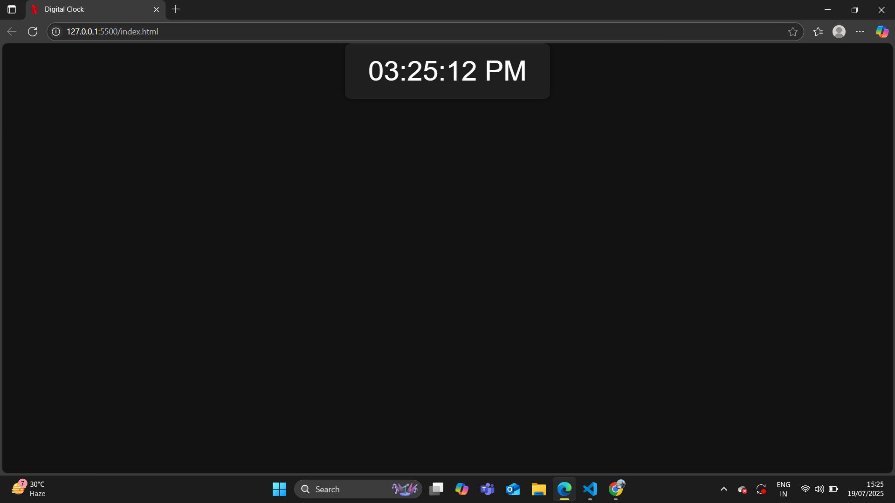

# Digital Clock App

A simple **Digital Clock** built using **HTML, CSS, and JavaScript**.  
It displays the current time in **12-hour format** with AM/PM indicator and updates every second.

---

## 🔗 Live Demo
[https://tickify-clock.netlify.app/]

---

## 📸 Screenshot

---

## ✨ Features
- Real-time digital clock
- 12-hour format with AM/PM
- Auto-updates every second
- Responsive and clean design

---

## 🛠️ Technologies Used
- **HTML5** – Structure
- **CSS3** – Styling
- **JavaScript (Vanilla JS)** – Dynamic time update

